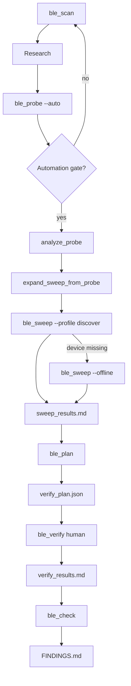

# BLE Protocol Reverse-Engineering Skill

**Self-contained workflow.** An LLM can execute this document with no other project context. Copy the entire `ble-hack-skill/` folder anywhere; the only runtime dependency is a BLE-capable host with Rust (`btleplug` + `tokio`) or an equivalent BLE stack.

**Deliverable:** a living `FINDINGS.md` — precise, table-driven, actionable for the next human or LLM session.

> **Humans:** follow `README.md` § Quickstart — copy-paste commands only.  
> **Agents / deep reference:** this file (`SKILL.md`).

**Do not assume a frame header** (e.g. `0x55`). That is one convention on some UART-style modules, not universal. Discover framing from automated scan, research, and live traffic.

---

## Purpose

This skill automates reverse-engineering of proprietary BLE peripheral protocols — **any brand, any product**, with emphasis on intimate-wellness / sex-tech devices that rarely publish specs.

The agent always:

1. **Scans** nearby BLE devices and ranks them by manufacturer heuristics.
2. **Selects** the most likely target (non–major-OEM, name/brand match, UART services).
3. **Researches** similar protocols (buttplug.io, web) before byte-sweeping.
4. **Discovers** frame layout, handshake, and control commands on hardware.
5. **Writes and maintains** `FINDINGS.md` per the specification in [FINDINGS.md Specification](#findingsmd-specification-authoritative) below.

User input (device address, product name, captures) **accelerates** the run but is **not required** to start.

---

## Algorithm (authoritative)

Every session follows the same state machine. Artifacts chain forward; nothing skips a gate.



| Phase | Binary | Input → output | Gate |
|-------|--------|----------------|------|
| 0 Scan | `ble_scan` | air → `scan_results.md`, `ble_session.json` | `PRIMARY`/`CANDIDATE` + name match |
| 1 Research | agent | web → notes (not FINDINGS) | before byte sweeps |
| 2 Probe | `ble_probe --auto` | device → `test_results.md` | FFE1 echo or non-standard |
| 3 Analyze | `analyze_probe` | probe rows → hot opcodes, tails, header | header = motor-channel vote |
| 4 Expand | `expand_sweep_from_probe` | analysis → frame list | no external command tables |
| 5 Sweep | `ble_sweep --profile discover` | frames → `sweep_results.md` | live BLE; `--offline` if device absent |
| 6 Plan | `ble_plan` | sweep hits → `verify_plan.json` | ≥1 checkpoint |
| 7 Verify | `ble_verify` | plan + human → `verify_results.md` | **y** = success per checkpoint |
| 8 Check | `ble_check` | all artifacts → `FINDINGS.md` | `Ready for FINDINGS: true` |

**One command:** `ble_run` executes phases 0→6, then 7 interactively, then 8. Live sweep falls back to `--offline` automatically when the device is unreachable.

**Provenance rule:** `FINDINGS.md` contains only `verify_results.md` success rows. Probe and sweep produce candidates; verify produces truth.

---

## Automated Pipeline (Run in Order)

**Requires Bluetooth host permissions** (not sandbox). On macOS, run from a terminal with BLE access.

```
STEP 0  cargo run -p ble-hack-skill --bin ble_scan -- --brand X --product Y --discover --output scan_results.md
        → pick UUID; confirm FFE1/FFE2 on target
STEP 1  Research buttplug + GitHub + official app name (before byte sweeps)
        → note OEM stack, likely tail types (CRC / AA / 00)
STEP 2  cargo run -p ble-hack-skill --bin ble_probe -- --device UUID --auto --output test_results.md
        → header vote on FFE1 only; opcode sweep; tail-family probes (CRC / AA)
STEP 3  cargo run -p ble-hack-skill --bin ble_sweep -- --device UUID --profile discover --probe test_results.md --output sweep_results.md
        → algorithmic grid from probe analysis (no reference command tables)
        → without hardware: add `--offline` to synthesize hits from probe evidence
STEP 4  cargo run -p ble-hack-skill --bin ble_plan -- --workdir .
        → writes verify_plan.json from sweep echo/non-standard hits only
STEP 5  cargo run -p ble-hack-skill --bin ble_verify -- --workdir .
        → user observes movement; y/n/r/q each checkpoint
STEP 6  cargo run -p ble-hack-skill --bin ble_check -- --workdir . --brand BRAND
        → completeness gate + FINDINGS.md from verify success rows only
```

**One-go invocation:** `/ble-hack-skill` → run `ble_run` (or the loop below) until `FINDINGS.md` is complete or you are blocked on human verify.

```bash
# From the project root that contains ble-hack-skill/ and session artifacts:
cargo run -p ble-hack-skill --bin ble_run -- --brand BRAND --product PRODUCT --workdir .
```

`ble_run` repeats scan → probe until the **automation gate** passes, then discover sweep (live or offline fallback) → `ble_plan` → interactive `ble_verify` → `ble_check` → `FINDINGS.md`.

### One-go iteration contract (agent)

The agent **does not stop** after a single silent probe or wrong scan target. Loop until success or a hard blocker:

| Gate | Pass condition | On fail |
|------|----------------|---------|
| Scan | `PRIMARY`/`CANDIDATE` with **local name match** when `--product` set | Rescan; ask user to power device, disconnect official app |
| GATT | `FFE1`/`FFE2` (or discovered write/notify pair) on target | Try next candidate; do not byte-sweep on anonymous RSSI winner |
| Probe | Echo or non-silent response on FFE1; tail-family hits (AA/CRC) | Retry probe; extend opcode sweep |
| Sweep | `ble_sweep --profile discover` hits cover motor families | Re-probe; check header vote; try `--offline` if device absent |
| Plan | `ble_check` reports 0 missing sweep→plan gaps | Revise `expand_sweep_from_probe` rules or re-sweep |
| Verify | User presses **y** at each checkpoint | Revise `verify_plan.json`; re-probe failed families only |
| FINDINGS | `ble_check` → `Ready for FINDINGS: true` | Never copy echo-only probe rows |

**Success** = `ble_check` reports `Ready for FINDINGS: true` (sweep hits ⊆ plan ⊆ verify success) and `FINDINGS.md` renders from those rows.

**Hard blocker** = device not advertising, no GATT write channel after 5 iterations, probe expansion cannot cover sweep hits, or user quits verify.

Manual equivalent of `ble_run`:

```
STEP 0–4  (loop until automation gate passes)
STEP 5    ble_verify — user at device
STEP 6    FINDINGS.md ← verify success rows only
```

**If Step 0 yields only SKIP / LOW devices**, fall back to the [Core Loop](#core-loop-fallback).

---

## Anti-patterns — do not repeat

These caused wrong protocol conclusions despite plausible BLE logs. **Hard rules:**

1. **Never write FINDINGS.md before `ble_verify` completes.** Probes produce candidates only.
2. **Never mark a command verified because Tx echoed it.** Wrong frames can echo. Confirm **physical movement** (y at checkpoint).
3. **Never assume one tail byte for all opcodes.** On KooSync/Svakom-style devices: test **fixed `AA`**, **CRC-8 C2** (`frame_with_crc`), and **fixed `00`** separately per opcode.
4. **Never skip opcode families.** If research names an official app, sweep its primary path first (e.g. Boost `0x04` before guessing `0x08`).
5. **Never map bytes from echo alone.** Validate byte semantics with isolated checkpoints (one family at a time).
6. **Never treat status/battery byte changes as motor proof.** Read `55 02 …` for SOC; dropping byte ≠ thrust confirmed.
7. **Never merge tail families in one verify checkpoint.** Boost (AA), stretch (CRC `p1=0x00`), M-mode (CRC `p1=0x03`) are separate rows in `verify_plan.json`.
8. **Never seed verify hex from a reference document.** Candidates must flow `ble_probe` → `analyze_probe` → `expand_sweep_from_probe` → `ble_sweep` hits → `ble_plan`.
9. **Never pick a scan target on RSSI alone.** Prefer **local name match** (`--brand` / `--product`) and UART GATT (`FFE0`/`FFE1`/`FFE2`) over anonymous high-RSSI peripherals that may share a chip OEM but are unrelated products.

When probe says **echo** → add to `verify_plan.json`, not FINDINGS.md.

---

## Step 0: Automated BLE Scan (`ble_scan`)

### Run

```bash
cd ble-hack-skill
cargo run --bin ble_scan
cargo run --bin ble_scan -- --brand Svakom --product Klitty
cargo run --bin ble_scan -- --discover
cargo run --bin ble_scan -- --seconds 5 --output scan_results.md
```

### What it does

| Action | Detail |
|--------|--------|
| Scan | Default 3 s; enumerates **every** nearby peripheral |
| Manufacturer decode | Reads Bluetooth SIG company ID from advertisement manufacturer data |
| Deprioritize major OEMs | Apple, Microsoft, Samsung, Google, Intel, Broadcom, Meta, Sony, Dell, HP, Bose, Amazon, Xiaomi, Huawei, Logitech, etc. — typical phones, laptops, watches |
| Prioritize candidates | Unknown manufacturer, niche OEM, UART service UUIDs (`FFE0`/`FFE1`/`FFE2`) |
| Brand/product match | Optional `--brand` / `--product` boost devices whose **local name** matches (product token is matched inside the name, e.g. `Klitty` matches `Svakom Klitty`) |
| Rank | `PRIMARY` ≥ 80, `CANDIDATE` ≥ 40, `LOW` &lt; 40, `SKIP` &lt; 0 (major OEM) |
| GATT discovery | `--discover` connects to top candidate and lists full service/characteristic UUIDs |
| Output | Terminal table + optional `scan_results.md` |

### Agent obligations after scan

1. Take the **recommended target** (highest tier, highest RSSI).
2. **Web-verify** the manufacturer: confirm the company actually makes this product category (critical for sex-tech — e.g. Svakom, Lovense, We-Vibe, Satisfyer, Kiiroo). Manufacturer ID may be a **chip OEM** (Actions, Nordic) while brand appears in **local name** — match on name when IDs disagree.
3. Copy into `FINDINGS.md` → **Configuration**: device UUID, name, manufacturer ID + verified name, advertised/partial service UUIDs.
4. If `--discover` was not run, run it before protocol work to pin Rx (write) and Tx (notify) characteristics.

### Ranking heuristics (why this works)

Most BLE noise in a home/office is Apple/Microsoft/Samsung devices. A powered-on intimate device typically:

- Advertises a **product local name** (not a laptop name)
- Uses a **non–major-OEM** manufacturer ID or none
- Often exposes **UART-style** 16-bit UUIDs `0xFFE0`–`0xFFE2`

This alone locates the target often enough to skip manual address entry.

---

## Probe-driven sweep expansion (no hardcoded command tables)

After `ble_probe --auto`, `analyze_probe(test_results.md)` derives:

| Signal | Source rows | Effect on sweep |
|--------|-------------|-----------------|
| Frame header | Majority vote on FFE1 `opcode_*` / `tail_*` rows | Correct `0x55` header (ignore non-motor channel header probes) |
| Hot opcodes | Echo or useful non-standard on FFE1 | Families to expand |
| Tail per opcode | `tail_aa_*`, `tail_crc_*`, or CRC/AA-shaped hits | AA scale grid, CRC stretch/M grid, or zero-tail param grid |
| Stretch subcmds | `tail_crc_*` with opcode `0x08` byte 3 | `p0=0x00` level grid, `p0=0x01` stop, `p0=0x03` M-mode grid |
| Query opcodes | `tail_crc_query_*` or CRC zero-param hits (`0x02`, `0xA0`) | Single CRC query frame per opcode |

`ble_sweep --profile discover --probe test_results.md` sends only frames from `expand_sweep_from_probe()`.

`ble_check` compares expansion ⊇ sweep hits ⊇ verify plan ⊇ FINDINGS — **no external reference doc**.

---

## Step 6: Human verification (`ble_verify`)

**Required before FINDINGS.md.**

```bash
cargo run -p ble-hack-skill --bin ble_verify -- --workdir .
```

Device UUID is read from `ble_session.json` (written by `ble_run` / scan) or `scan_results.md`. Override with `--device` only when needed.

1. User watches device during each checkpoint burst.
2. Compare to `expect` in plan — thrust, stop, vibration, etc.
3. Press **y** / **n** / **r** / **q** (see README).

Plan comes from `ble_plan` (sweep hits). Include stop command per family. Only **y** rows → FINDINGS.md.

## Step 7: Pipeline check (`ble_check`)

```bash
cargo run -p ble-hack-skill --bin ble_check -- --workdir . --brand BRAND --product PRODUCT
```

Confirms probe expansion covers sweep hits, sweep hits are in verify plan, and verify success rows are complete. Regenerates `FINDINGS.md` from verify rows only.

---

## Core Loop (Fallback)

Use when automated scan does not surface a clear target, or ranking is ambiguous (multiple CANDIDATEs at similar RSSI).

```
0. DISCOVER DEVICE + RESEARCH
1. CONNECT + TRANSPORT VERIFY
2. DISCOVER FRAME HEADER + LAYOUT
3. ESTABLISH SESSION (handshake if required)
4. SEND CANDIDATE COMMAND
5. READ TX NOTIFICATION + OPTIONAL STATUS QUERY
6. CLASSIFY RESULT
7. UPDATE FINDINGS.md
8. CHOOSE NEXT EXPERIMENT (narrow or recurse)
```

**Recurse** when a channel is promising but semantics are unclear: change one byte, fresh connection after handshake, compare physical behavior vs BLE replies.

**Iterate** when a sweep is flat: change header, length, subcmd, params, multi-frame timing.

Stop when a path is a **dead end** (echo-only, silent, idle loop).

### Generic header probes (no assumed sync byte)

```
Probe A — sync sweep:     [H] 00 00 00 00 00 00     H ∈ 00, 55, AA, A5, 5A, FF
Probe B — UART-style:       [H] 01 00 00 00 00 00     H ∈ 00, 55, AA
Probe C — length-prefixed:  03 [H] 00 00               H ∈ 00, 55, AA
```

Ask the user: which writes produced Tx data, response length, physical movement?

---

## Research Pass (Before Hardware Sweeps)

Mandatory large research pass **before** byte grids:

1. **buttplug.io** — https://github.com/buttplugio/buttplug — contributed device protocols by brand/OEM.
2. **GitHub / forums** — `{brand} BLE protocol`, `{product} FFE1`, `buttplug {brand}`.
3. **Bluetooth SIG company IDs** — https://www.bluetooth.com/specifications/assigned-numbers/
4. **Adjacent brands** — Chinese OEMs often share UART framing (`0x55`, 7-byte frames) across lines.

**Spawn a research subagent** (different model/provider) to survey buttplug + web; merge into `FINDINGS.md` → **Research Notes** with source links.

---

## BLE Client Requirements

Any minimal client (Rust `btleplug` recommended) must:

| Step | Action |
|------|--------|
| Scan | 2–3 s; log all devices during discovery |
| Connect | One GATT client; disconnect official app / Bluetility |
| Subscribe | Tx notify **before** sending commands |
| Write | Default write-without-response unless proven otherwise |
| Wait | ~500 ms per notification; drain stale notifications before each send |
| Handshake gap | ~80 ms between init frames when multi-frame init is used |
| Motor sustain | Many devices need commands repeated ~50 ms to hold state |

Constants to set **after scan + GATT discovery** (never hardcode from another device):

- `DEVICE_ADDRESS` — UUID (macOS) or MAC
- `RX_CHARACTERISTIC_UUID` / `TX_CHARACTERISTIC_UUID`

---

## Frame Header Discovery

| Priority | Candidate | Typical families |
|----------|-----------|------------------|
| 1 | `0x55` | Svakom, many UART OEM modules |
| 2 | `0xAA` | Alternate sync |
| 3 | `0xA5` / `0x5A` | Checksum-framed |
| 4 | None | Length-prefixed or raw commands |

Confirmed header = consistent non-idle Tx responses, not random echo.

### Common layouts

```
Pattern A (7-byte UART):  [HDR] [TYPE] [SUB] [P1] [P2] [P3] [SUFFIX]
Pattern B (4-byte):       [HDR] [CMD] [VAL] [CHK]
Pattern C (variable):     [LEN] [PAYLOAD...] [CHK]
```

---

## Handshake Verification

1. Hypothesize init sequence from research (often 2–3 frames in &lt;250 ms).
2. Send immediately after connect + subscribe.
3. Record exact bytes in `FINDINGS.md` → **Session Start** as Rust `const HANDSHAKE`.
4. Re-test commands that failed pre-handshake.
5. **Ask user:** repeated connect → handshake → disconnect → does device **reset** (homing, short buzz, LED)? Record yes/no in FINDINGS.md.

---

## Response Classification

| Class | Meaning | Action |
|-------|---------|--------|
| **echo** | response == sent | **Inconclusive** — queue for `ble_verify`; do not mark verified |
| **standard ack** | fixed short ack | Query candidate — verify read semantics with user |
| **fixed blob** | same long response | Device info — verify once, usually read-only |
| **status read** | stable marker byte | Read-only; status delta alone is **not** motor proof |
| **silent** | no notification | Wrong shape/channel — try other tail or channel |
| **idle** | default loop | Pre-init or wrong channel |
| **non-standard** | unusual length/bytes | Queue for `ble_verify` |
| **physical only** | moves, BLE unchanged | **Verified motor path** — still run `ble_verify` to capture hex |

Only **ble_verify success** rows go into FINDINGS.md. Echo and non-standard are **candidates only**.

---

## Command Sweeps (After Handshake)

Order **most likely → least likely** from research:

1. Type/command sweep — fix header, sweep command byte
2. Subcmd sweep — fix command, sweep subcmd
3. Param sweep — fix command + subcmd, sweep P1, P2
4. Multi-frame — init → query → command without status between
5. Write-with-response — test once; document if unsupported

Do **not** re-sweep dead ends. Always ask user about **physical movement** when BLE status is flat.

---

## Per-Command Verification

Replaced by **`ble_verify`** (Step 6). Do not batch-verify in one headless run.

For each checkpoint in `verify_plan.json`:

1. Single command under test (+ optional stop frame)
2. User selects **y / n / r / q** at terminal
3. Success → row in FINDINGS.md; Error → revise plan and re-probe

---

## Multi-Agent Research

| Agent | Role |
|-------|------|
| Main | BLE scan, connect, sweeps, `FINDINGS.md` updates |
| Research subagent | buttplug survey, SIG IDs, FCC/manuals, handshake hypotheses with sources |

Research agent does **not** send BLE traffic.

---

## When to Stop

- Single/multi-frame and write-type variants exhausted as dead ends
- Control channel confirmed physically; BLE status may stay static
- Remaining work = official app packet capture

Open question template:

> Capture {official app} traffic on opcode `{XX}` post-handshake and diff against probe frames.

---

## FINDINGS.md Specification (Authoritative)

Copy `FINDINGS.template.md` as the starting point. Any LLM writing `FINDINGS.md` **must** follow that structure.

**Principle:** FINDINGS.md is a **verified success command set** only. Scan logs, research, dead ends, and probe grids go in auxiliary files — not FINDINGS.md.

### Required sections (in order)

#### 1. Title

```markdown
# {Brand} {Product} — Verified BLE Commands
```

Opening line: document only commands that work; exclude rejected/no-action probes.

#### 2. Device Info

| Item | Value |
| --- | --- |
| Brand | … |
| Product | … |
| Internal model | … (omit row if unknown) |
| Product code | … (omit if unknown) |
| Official app | … |

#### 3. BLE UUID

| Role | UUID |
| --- | --- |
| Service | full 128-bit UUID |
| Write | Rx characteristic |
| Notify | Tx characteristic |

#### 4. Frame Format

- Layout: `55 <cmd> <p0> <p1> <p2> <p3> <tail>`
- Table: command family → tail rule (CRC-8 C2, fixed `AA`, fixed `00`, …)
- If CRC-8 C2 applies, document poly/init/xorout/refin/refout; use `src/crc.rs` when probing

**Do not assume one tail byte for all opcodes.** Some UART OEM stacks use CRC on one opcode family and fixed `AA` or `00` on another — test each family separately.

#### 5+. One `##` section per verified command family

Each confirmed family (Boost, Direct Stretch, M-modes, battery query, status query, …) gets:

- **Command format** — hex pattern with named fields
- **Field table** — range and meaning
- **Verified commands** — `{key} | Command | Effect` (or Query / Response for reads)
- **Confirmed behavior** — user-verified bullets only

#### Last: Implementation Notes (optional)

Short table: use case → family → hex pattern.

---

### Explicitly excluded from FINDINGS.md

| Old section | New home |
| --- | --- |
| Scan Results | `scan_results.md` |
| Research Notes | agent / `test_results.md` |
| Session Start | only if verified required |
| Dead Ends / Open Questions | omit |
| Protocol Model | omit |
| Rust `const` blocks | use spaced hex in tables |

---

### FINDINGS.md style rules

- **Verified only** — NACK or no movement → not in FINDINGS.md
- **Hex in fenced blocks or tables**
- **Name fields** in patterns (`<mode>`, `<scale>`, `<travel>`, `<CRC>`)
- **Effect column** requires user-confirmed physical result, not BLE echo alone
- **One section per actuator family**, not one merged opcode table

### Auxiliary files

Written in the **project root** (the repo using this skill), not inside `ble-hack-skill/`:

| File | Contents |
| --- | --- |
| `scan_results.md` | Full scan from `ble_scan` |
| `test_results.md` | Probe grid from `ble_probe` |
| `sweep_results.md` | Parameter sweep from `ble_sweep` |
| `verify_results.md` | Human gate from `ble_verify` — **source of truth for FINDINGS.md** |
| `verify_plan.json` | Checkpoint script for Step 6 |
| `FINDINGS.md` | Verified commands only |

Merge **success** rows from `verify_results.md` into FINDINGS.md; never from probe grids alone.

### Tail-byte discovery (agent)

After header `0x55` is confirmed:

1. Fixed `AA` — e.g. `55 04 00 00 00 {scale} AA` on some video-sync thrust families
2. CRC-8 C2 — `frame_with_crc([55, cmd, p0, p1, p2, p3])` (Stretch / M-mode)
3. Fixed `00` — legacy Svakom 7-byte (Klitty vibrate)

Validate with **physical effect** — wrong tails may still echo on some firmware.

---

## `ble_scan` / `ble_probe` / `ble_sweep` / `ble_verify` Implementation Reference

This folder ships Rust binaries (`btleplug` + `tokio`):

| File | Role |
| ---- | ---- |
| `src/manufacturers.rs` | SIG company ID classify (major OEM vs niche vs unknown) |
| `src/crc.rs` | CRC-8 C2 tail (`frame_with_crc`, `frame_with_aa`) |
| `src/probe_analyze.rs` | Parse probe results; `expand_sweep_from_probe()` |
| `src/discover.rs` | Sweep→plan→FINDINGS; `completeness_report()` |
| `src/verify.rs` | Verify plan types + `verify_results.md` parsing |
| `src/session.rs` | Shared connect, subscribe, send, burst, handshake |
| `src/bin/ble_scan.rs` | Scan, rank, optional `--discover` GATT dump |
| `src/bin/ble_probe.rs` | Header probes, opcode sweep, tail-family probes, `--auto` |
| `src/bin/ble_sweep.rs` | Generic grid or `--profile discover` (probe-expanded) |
| `src/bin/ble_plan.rs` | Write verify plan from sweep hits (no BLE) |
| `src/bin/ble_run.rs` | One-go: scan → probe → discover sweep → verify → FINDINGS |
| `src/bin/ble_check.rs` | Pipeline completeness gate + FINDINGS regen |
| `src/bin/ble_findings.rs` | Render FINDINGS.md from verify success rows |
| `src/pipeline.rs` | Scan ranking, target pick, automation gate |
| `verify_plan.example.json` | Minimal example plan shape (prefer `ble_plan` output) |
| `Cargo.toml` | Dependencies |

### `ble_verify` flags

| Flag | Purpose |
| ---- | ------- |
| `--device UUID` | Target peripheral |
| `--plan path` | JSON checkpoint plan (required) |
| `--output path` | Write `verify_results.md` (default) |

### `ble_sweep` flags

| Flag | Purpose |
| ---- | ------- |
| `--device UUID` | Target peripheral (required unless `--offline`) |
| `--profile discover` | Probe-expanded grid (preferred) |
| `--profile generic` | Blind opcode/param grid for unknown devices |
| `--probe path` | `test_results.md` for discover profile |
| `--offline` | Synthesize sweep hits from probe evidence (no BLE) |
| `--output path` | Write `sweep_results.md` |

### `ble_run` flags

| Flag | Purpose |
| ---- | ------- |
| `--brand` / `--product` | Scan filters; require name match when set |
| `--workdir path` | Artifact directory (default `.`) |
| `--skip-verify` | Stop after plan; print verify/check commands |
| `--offline-sweep` | Skip live BLE sweep; use `--offline` synthesis |
| `--max-iter N` | Scan/probe retry limit (default 5) |
| `--discover` | Re-run GATT discovery on scan target |

### `ble_probe` flags

| Flag | Purpose |
| ---- | ------- |
| `--device UUID` | Target peripheral (from ble_scan) |
| `--auto` | Full discovery: headers → opcode sweep → burst candidates |
| `--channel ffe1` | Limit to one Rx/Tx pair |
| `--header-sweep` / `--opcode-sweep` | Individual phases |
| `--handshake` | Send Svakom-style 3-frame init before probes |
| `--burst "55 …"` | Sustain frames for N seconds |
| `--output path` | Write `test_results.md` |

Flags: `--brand`, `--product`, `--seconds`, `--output`, `--discover`

Ranking scores (approximate):

| Signal | Score |
|--------|-------|
| Major consumer OEM | −100 (SKIP) |
| Unknown / non-major manufacturer | +40 |
| UART FFE0/FFE1/FFE2 advertised | +50 |
| `--brand`/`--product` name match | +80 |

---

## Checklist (Every Session)

- [ ] `ble_scan --discover` → UUID + Rx/Tx UUIDs
- [ ] Research app/OEM **before** sweeps
- [ ] `ble_probe --auto` → candidates in `test_results.md`
- [ ] `ble_sweep --profile discover --probe test_results.md`
- [ ] `ble_plan` → `verify_plan.json` from sweep hits
- [ ] **`ble_verify` with user watching device**
- [ ] `ble_check` → `Ready for FINDINGS: true` + FINDINGS.md
- [ ] Official app disconnected during connect

---

## External References

| Resource | URL |
|----------|-----|
| Buttplug protocols | https://github.com/buttplugio/buttplug |
| Bluetooth SIG IDs | https://www.bluetooth.com/specifications/assigned-numbers/ |
| Buttplug docs | https://buttplug.io |

---

## Worked examples (not defaults)

| Device | FINDINGS style | Key protocol facts |
| ------ | -------------- | ------------------ |
| Svakom Klitty | Verified commands | `0x55` 7-byte, tail `00`; opcodes `03`/`09`/`14`; sustain ~50 ms |
| Kaotik Jetpack / HF470 | Verified commands | Example of probe-driven discover: Boost `0x04` tail `AA`; Stretch/M `0x08` tail CRC-8 C2; query `0x02`/`0xA0`; ~44 verify checkpoints when sweep hits full grid |

Do not copy bytes across devices. See `FINDINGS.template.md` for output format.
