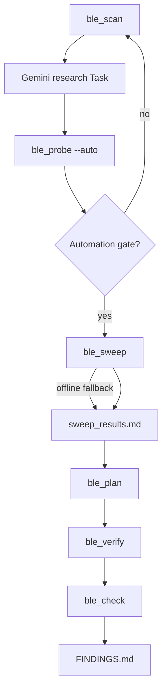

# BLE Protocol Reverse-Engineering Skill

**Self-contained workflow.** Copy `ble-hack-skill/` anywhere; runtime needs a BLE-capable host with Rust (`btleplug` + `tokio`).

**Deliverable:** `FINDINGS.md` — verified commands only, table-driven.

**Package boundary:** `ble-hack-skill/` is product-agnostic. Session artifacts, `FINDINGS.md`, and product-specific code live in the **project root** (`--workdir .`), not inside this folder.

> **Humans:** `README.md` — copy-paste commands.  
> **Agents:** this file.

**Do not assume a frame header** (e.g. `0x55`). Discover framing from scan, research, and probes.

---

## Purpose

Reverse-engineer proprietary BLE peripheral protocols — any brand, emphasis on sex-tech devices without public specs.

1. **Scan** and rank peripherals (name match, UART GATT, non–major-OEM).
2. **Research** via Gemini Task before byte sweeps.
3. **Probe** → **sweep** → **plan** → **human verify** → **FINDINGS.md**.
4. Keep this folder generic; product specifics go in the project root.

---

## Skill package vs project repo

| Project root (`--workdir .`) | Not under `ble-hack-skill/` |
| --- | --- |
| `scan_results.md`, `test_results.md`, `sweep_results.md`, `verify_plan.json`, `verify_results.md`, `FINDINGS.md` | Product-named tools, hardcoded UUIDs, handshakes, command tables |

**Agent rule:** if a change is tied to one product, implement it in the project root.

---

## Algorithm



| Phase | Tool | Output | Gate |
|-------|------|--------|------|
| 0 Scan | `ble_scan --discover` | `scan_results.md`, `ble_session.json` | `PRIMARY`/`CANDIDATE` + name match |
| 1 Research | Task `gemini-3.1-pro` | subagent reply | before sweeps |
| 2 Probe | `ble_probe --auto` | `test_results.md` | FFE1 echo or non-standard |
| 3 Sweep | `ble_sweep` | `sweep_results.md` | probe-expanded frames; `--offline` if no device |
| 4 Plan | `ble_plan` | `verify_plan.json` | ≥1 checkpoint |
| 5 Verify | `ble_verify` | `verify_results.md` | **y** = physical success |
| 6 Check | `ble_check` | `FINDINGS.md` | `Ready for FINDINGS: true` |

**One command** (from project root):

```bash
cargo run -p ble-hack-skill --bin ble_run -- --brand BRAND --product PRODUCT --workdir .
```

`ble_run` loops scan → probe until the automation gate passes, then sweep (live or offline) → plan → interactive verify → check.

**Provenance:** `FINDINGS.md` = `verify_results.md` success rows only. Probe/sweep = candidates.

**If verify failure rate > 30%**, restart from research and scan.

### Iteration gates

| Gate | Pass | On fail |
|------|------|---------|
| Scan | Name match when `--product` set | Rescan; disconnect official app |
| GATT | FFE1/FFE2 or discovered write/notify pair | Next candidate |
| Probe | Echo/non-standard on motor channel | Retry; `--handshake` if research suggests init |
| Sweep | Hits cover motor families | Re-probe; `--offline` if device absent |
| Verify | User **y** at checkpoints | Revise plan; re-probe failed families |

---

## Anti-patterns

1. Never write `FINDINGS.md` before `ble_verify`.
2. Never verify from Tx echo alone — confirm **physical movement**.
3. Never assume one tail byte for all opcodes — test **AA**, **CRC-8 C2**, **00** per family.
4. Never seed verify hex from reference docs — flow: probe → sweep → plan.
5. Never pick scan target on RSSI alone — prefer name + UART GATT.
6. Never add product-specific code inside `ble-hack-skill/`.

---

## Research Pass

Spawn a **Task** before `ble_probe --auto`. No subagent files in the repo.

| Field | Value |
| --- | --- |
| `subagent_type` | `generalPurpose` |
| `model` | `gemini-3.1-pro` |
| `readonly` | `true` |

Pass brand, product, `scan_results.md` excerpts, probe failures. Prompt the subagent to survey buttplug.io, GitHub, Bluetooth SIG IDs, and adjacent OEM stacks; return sourced handshake/opcode hypotheses and recommended probe order. Every claim needs a URL. Do not write `FINDINGS.md`.

---

## Manual steps (if not using `ble_run`)

Requires BLE permissions (not sandbox).

```bash
cargo run -p ble-hack-skill --bin ble_scan -- --brand X --product Y --discover --output scan_results.md
# Gemini research Task
cargo run -p ble-hack-skill --bin ble_probe -- --device UUID --auto --output test_results.md
cargo run -p ble-hack-skill --bin ble_sweep -- --device UUID --probe test_results.md --output sweep_results.md
# or: --offline --probe test_results.md
cargo run -p ble-hack-skill --bin ble_plan -- --workdir .
cargo run -p ble-hack-skill --bin ble_verify -- --workdir .
cargo run -p ble-hack-skill --bin ble_check -- --workdir . --brand BRAND --product PRODUCT
```

`ble_verify`: **y** success · **n** fail · **r** replay · **q** quit. Device UUID from `ble_session.json` or `scan_results.md`.

---

## Fallback (scan ambiguous or automation stuck)

1. Connect; subscribe notify before writes; disconnect official app.
2. Header sweep: `[H] 00 00 00 00 00 00` for H ∈ 00, 55, AA, A5, 5A, FF (`ble_probe --header-sweep`).
3. If research suggests init, `ble_probe --handshake --auto`.
4. Try alternate GATT channels (`gatt.rs` discovers write/notify pairs).
5. Classify responses (table below); recurse one byte at a time.
6. Dead end = echo-only, silent, or idle loop — stop that path.

### Response classification

| Class | Action |
|-------|--------|
| **echo** | Queue for verify; inconclusive alone |
| **non-standard** | Queue for verify |
| **silent** | Wrong channel/shape |
| **status read** | Not motor proof |
| **physical only** | Run `ble_verify` to capture hex |

---

## FINDINGS.md

Follow `FINDINGS.template.md`. **Verified commands only** — no scan logs, research, or probe grids.

`ble_check` regenerates `FINDINGS.md` from verify success rows. Tail families (AA / CRC-8 C2 / `00`) are tested separately; use `src/crc.rs` for CRC-8 C2.

---

## Binaries

| Binary | Role |
|--------|------|
| `ble_run` | Full pipeline orchestrator |
| `ble_scan` | Scan, rank, `--discover` GATT dump |
| `ble_probe` | Header/opcode/tail probes; `--auto` |
| `ble_sweep` | Probe-expanded frame sweep; `--offline` synthesis |
| `ble_plan` | `verify_plan.json` from sweep hits (no BLE) |
| `ble_verify` | Interactive human gate |
| `ble_check` | Pipeline completeness + `FINDINGS.md` |

Key flags:

- **ble_scan:** `--brand`, `--product`, `--discover`, `--seconds`, `--output`
- **ble_probe:** `--device`, `--auto`, `--handshake`, `--channel`, `--output`
- **ble_sweep:** `--device`, `--probe`, `--offline`, `--output`
- **ble_run:** `--workdir`, `--skip-verify`, `--offline-sweep`, `--max-iter`, `--discover`

Shared libraries: `session.rs` (connect/send/burst), `gatt.rs` (channel discovery), `probe_analyze.rs` (expand sweeps from probe), `discover.rs` (plan + FINDINGS render), `manufacturers.rs`, `crc.rs`, `pipeline.rs` (scan rank for `ble_run`).

---

## Checklist

- [ ] `ble_scan --discover` → UUID + Rx/Tx
- [ ] Gemini research Task
- [ ] `ble_probe --auto`
- [ ] `ble_sweep` (or `--offline`)
- [ ] `ble_plan` → `ble_verify` (user at device) → `ble_check`
- [ ] Official app disconnected during BLE work
