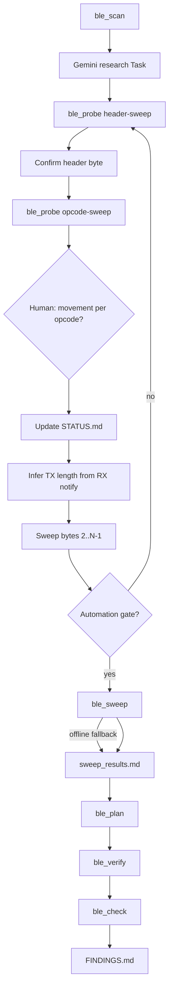

# BLE Protocol Reverse-Engineering Skill

**Self-contained workflow.** Copy `ble-hack-skill/` anywhere; runtime needs a BLE-capable host with Rust (`btleplug` + `tokio`).

**Deliverables:** `STATUS.md` (living session state) and `FINDINGS.md` (verified commands only).

**Package boundary:** `ble-hack-skill/` is product-agnostic. Session artifacts, `FINDINGS.md`, and product-specific code live in the **project root** (`--workdir .`), not inside this folder.

> **Humans:** `README.md` — copy-paste commands.  
> **Agents:** this file.

**Do not assume a frame header** (e.g. `0x55`). Discover framing from scan, research, and probes.

---

## Purpose

Reverse-engineer proprietary BLE peripheral protocols — any brand, emphasis on sex-tech devices without public specs.

1. **Scan** and rank peripherals (name match, UART GATT, non–major-OEM).
2. **Research** via Gemini Task before byte sweeps.
3. **Probe** (byte-by-byte) → **opcode human gate** → maintain **`STATUS.md`** → **sweep** → **plan** → **human verify** → **FINDINGS.md**.
4. Keep this folder generic; product specifics go in the project root.

---

## Skill package vs project repo

| Project root (`--workdir .`) | Not under `ble-hack-skill/` |
| --- | --- |
| `STATUS.md`, `scan_results.md`, `test_results.md`, `sweep_results.md`, `verify_plan.json`, `verify_results.md`, `FINDINGS.md` | Product-named tools, hardcoded UUIDs, handshakes, command tables |

**Agent rule:** if a change is tied to one product, implement it in the project root.

---

## Algorithm



| Phase | Tool | Output | Gate |
|-------|------|--------|------|
| 0 Scan | `ble_scan --discover` | `scan_results.md`, `ble_session.json` | `PRIMARY`/`CANDIDATE` + name match |
| 1 Research | Task `gemini-3.1-pro` | subagent reply | before sweeps |
| 2a Header | `ble_probe --header-sweep` | `test_results.md` | consistent non-silent on motor channel |
| 2b Opcode | `ble_probe --opcode-sweep --header H` | `test_results.md` + **`STATUS.md`** | **user y/n per actuating opcode** |
| 2c Length | compare TX vs RX notify length | notes in `test_results.md` | RX byte count locks TX frame size |
| 2d Payload | targeted probes / project `sweep_step` | per-byte notes | one byte position at a time |
| 3 Sweep | `ble_sweep` | `sweep_results.md` | only within confirmed frame families |
| 4 Plan | `ble_plan` | `verify_plan.json` | ≥1 checkpoint |
| 5 Verify | `ble_verify` | `verify_results.md` | **y** = physical success |
| 6 Check | `ble_check` | `FINDINGS.md` | `Ready for FINDINGS: true` |

**One command** (from project root):

```bash
cargo run -p ble-hack-skill --bin ble_run -- --brand BRAND --product PRODUCT --workdir .
```

`ble_run` loops scan → probe until the automation gate passes, then sweep (live or offline) → plan → interactive verify → check.

**Provenance:** `FINDINGS.md` = `verify_results.md` success rows only. `STATUS.md` = human-confirmed / rejected / open during discovery. Probe/sweep = candidates.

**If verify failure rate > 30%**, restart from research and scan. Update `STATUS.md` with rejections before re-probing.

### Iteration gates

| Gate | Pass | On fail |
|------|------|---------|
| Scan | Name match when `--product` set | Rescan; disconnect official app |
| GATT | FFE1/FFE2 or discovered write/notify pair | Next candidate |
| Probe | Echo/non-standard on motor channel | Retry header/opcode sweep |
| Opcode | User **y** on movement for each candidate opcode | Do not map motor from notify echo alone |
| Length | RX notify length stable per opcode family | Re-probe with 6 vs 7 byte TX before payload sweep |
| Sweep | Hits cover motor families | Re-probe; `--offline` if device absent |
| Verify | User **y** at checkpoints | Revise plan; re-probe failed families |

---

## Anti-patterns

1. Never write `FINDINGS.md` before `ble_verify`.
2. Never verify from Tx echo or notify mirror alone — confirm **physical movement** (agent chat **y/n** during opcode sweeps).
3. Never assume one tail byte for all opcodes — test **AA**, **CRC-8 C2**, **00** per family.
4. Never seed verify hex from reference docs — flow: header → opcode → length → payload → sweep → plan.
5. Never pick scan target on RSSI alone — prefer name + UART GATT.
6. Never add product-specific code inside `ble-hack-skill/`.
7. Never run wide `ble_sweep` before header, opcode, and frame length are confirmed.
8. Never assign a motor function to an opcode from `55 8X` notify alone — opcode sweeps need human movement confirmation.

---

## Research Pass

Spawn a **Task** before `ble_probe --auto`. No subagent files in the repo.

| Field | Value |
| --- | --- |
| `subagent_type` | `generalPurpose` |
| `model` | `gemini-3.1-pro` |
| `readonly` | `true` |

Pass brand, product, `scan_results.md` excerpts, probe failures. Prompt the subagent to survey buttplug.io, GitHub, Bluetooth SIG IDs, and adjacent OEM stacks; return sourced handshake/opcode hypotheses and recommended probe order. Every claim needs a URL. Do not write `FINDINGS.md`.

---

## Manual steps (if not using `ble_run`)

Requires BLE permissions (not sandbox).

```bash
cargo run -p ble-hack-skill --bin ble_scan -- --brand X --product Y --discover --output scan_results.md
# Gemini research Task
cargo run -p ble-hack-skill --bin ble_probe -- --device UUID --auto --output test_results.md
cargo run -p ble-hack-skill --bin ble_sweep -- --device UUID --probe test_results.md --output sweep_results.md
# or: --offline --probe test_results.md
cargo run -p ble-hack-skill --bin ble_plan -- --workdir .
cargo run -p ble-hack-skill --bin ble_verify -- --workdir .
cargo run -p ble-hack-skill --bin ble_check -- --workdir . --brand BRAND --product PRODUCT
```

`ble_verify`: **y** success · **n** fail · **r** replay · **q** quit. Device UUID from `ble_session.json` or `scan_results.md`.

---

## Byte-by-byte discovery (required before wide sweep)

Discover the frame **one field at a time**. Do not jump to level sweeps or `ble_sweep` until each gate below passes. Take time at each step — quality over speed.

### Order of operations

| Step | Byte(s) | Goal | Tool |
|------|---------|------|------|
| 1 | **0 — header** | Find the sync/prefix byte | `ble_probe --header-sweep` |
| 2 | **1 — opcode** (most likely) | Map which opcodes actuate which motors | `ble_probe --opcode-sweep --header H` + **human y/n** |
| 3 | **length** | Lock TX frame size | Compare sent TX length vs RX notify length |
| 4 | **2..N−1 — payload** | Mode, level, CRC/tail | Targeted probes; project `sweep_step` one frame at a time |
| 5 | **wide sweep** | Expand levels/presets within confirmed families | `ble_sweep` → `ble_plan` → `ble_verify` |

### Step 1 — Confirm header (byte 0)

```bash
cargo run -p ble-hack-skill --bin ble_probe -- --device UUID --channel ffe1 --header-sweep --output test_results.md
```

- Candidate headers: `00`, `55`, `AA`, `A5`, `5A`, `FF` (see `ble_probe` probe A/B/C patterns).
- **Pass:** one header gives consistent non-silent or structured notify on the motor write/notify pair (typically FFE1/FFE2).
- **Fail:** all silent — retry channel discovery (`ble_scan --discover`) or alternate GATT pair.

Record the winning header in `test_results.md` before continuing.

### Step 2 — Opcode sweep (byte 1) + human movement gate

```bash
cargo run -p ble-hack-skill --bin ble_probe -- --device UUID --channel ffe1 --opcode-sweep --header 55 --output test_results.md
```

For each opcode that returns a non-silent RX (echo or `opcode | 0x80` mirror):

1. Send one frame (or short burst) with that opcode.
2. **Prompt the user in agent chat:** “Opcode `0xNN` — did the device physically actuate? [y/n]”
3. Record **y** = candidate motor opcode; **n** = notify-only / no movement (do not map a motor).

**Notify mirror is not movement proof.** Example: TX `55 05 …` → RX `55 85 …` only proves the device parsed the frame — not that suction ran.

Only opcodes with human **y** advance to payload discovery and verify plans. Update **`STATUS.md`** after each opcode answer (Confirmed / Rejected / Open).

### Step 3 — Infer frame length from RX notify

Before sweeping bytes 2 onward, lock how many bytes to send:

1. Note **TX length** used in the opcode probe (default 7 bytes in `ble_probe`).
2. Note **RX notify length** for that opcode (often 6 bytes on SVAKOM-class stacks).
3. If RX is consistently **shorter** than TX and mirrors `byte1 | 0x80`, test **TX at RX length** (e.g. 6 bytes) vs TX+trailing `00` (7 bytes) — same actuation means use the shorter form.
4. Record the confirmed length per opcode family in `test_results.md` and **`STATUS.md`**.

Do not assume all opcodes share the same length or tail family — confirm per family.

### Step 4 — Subsequent bytes (payload)

With header, opcode, and length fixed:

- Hold bytes `0..1` and confirmed length constant.
- Vary one payload byte at a time (mode byte, level, CRC/AA tail).
- Use short bursts; ask the user **y/n** when a byte change produces a new physical effect.
- Dead end (silent or echo-only with no movement) — stop that branch.

Project repos may use `sweep_step` / `sweep_checkpoints` for this phase; keep those tools in the project root, not in `ble-hack-skill/`.

### Step 5 — Wide sweep and verify

Only after steps 1–4:

```bash
cargo run -p ble-hack-skill --bin ble_sweep -- --device UUID --probe test_results.md --output sweep_results.md
cargo run -p ble-hack-skill --bin ble_plan -- --workdir .
cargo run -p ble-hack-skill --bin ble_verify -- --workdir .
```

`ble_probe --auto` remains a fast bootstrap (header + opcode + tail families in one pass). Treat its output as **candidates** — still run the human opcode gate before trusting motor mapping.

---

## Fallback (scan ambiguous or automation stuck)

If byte-by-byte discovery stalls, use these in order:

1. Connect; subscribe notify before writes; disconnect official app.
2. Header sweep: `[H] 00 00 00 00 00 00` for H ∈ 00, 55, AA, A5, 5A, FF (`ble_probe --header-sweep`).
3. Opcode sweep on confirmed header; **human y/n per opcode** before mapping motors.
4. Lock TX length from RX notify size; test 6 vs 7 byte TX before payload sweeps.
5. Try alternate GATT channels (`gatt.rs` discovers write/notify pairs).
6. Classify responses (table below); recurse one byte at a time.
7. Dead end = echo-only, silent, or idle loop — stop that path.

### Response classification

| Class | Action |
|-------|--------|
| **echo** | Queue for verify; inconclusive alone |
| **non-standard** | Queue for verify |
| **silent** | Wrong channel/shape |
| **status read** | Not motor proof |
| **physical only** | Run `ble_verify` to capture hex |

---

## STATUS.md

Follow `STATUS.template.md`. Copy to the project root after the first successful scan:

```bash
cp ble-hack-skill/STATUS.template.md STATUS.md
```

Then **fetch the product information page** and fill **Product features (requirements)** at the top before probing. That section states which actuators must be mapped — keep the mandated sentence in place (see template).

**Purpose:** single place for **confirmed**, **rejected**, and **open** knowledge while discovery is in progress. Agents and humans read this before resuming work.

| Section | When to update |
| --- | --- |
| **Confirmed (human y)** | Header, channel, frame format, opcode → motor mapping after user **y** |
| **Rejected / corrected** | User **n**, notify-only opcodes, disproved assumptions (e.g. “level 00 = off”) |
| **Open questions** | Every non-silent opcode not yet human-tested; stop commands; length TBD |
| **Artifacts** | Pointer to session files in `--workdir` |
| **Next steps** | Concrete resume actions; set **Sweep paused** when blocking on human gates |

**STATUS.md vs FINDINGS.md**

| | `STATUS.md` | `FINDINGS.md` |
| --- | --- | --- |
| Audience | Agents mid-session | End user / integrator |
| Content | Hypotheses + rejections + gaps | Verified commands only |
| Source | Human y/n during opcode sweep + verify | `verify_results.md` success rows via `ble_check` |
| Update | Continuously during discovery | Regenerated when pipeline completes |

Pause wide sweep when opcode mapping is uncertain; note **Sweep paused** at the top of `STATUS.md` with resume conditions (see template). Include the product features fetched from product information page on the top of this file so that requirements are clearly specified (do not delete this sentence). 

---

## FINDINGS.md

Follow `FINDINGS.template.md`. **Verified commands only** — no scan logs, research, or probe grids.

`ble_check` regenerates `FINDINGS.md` from verify success rows. Tail families (AA / CRC-8 C2 / `00`) are tested separately; use `src/crc.rs` for CRC-8 C2.

---

## Binaries

| Binary | Role |
|--------|------|
| `ble_run` | Full pipeline orchestrator |
| `ble_scan` | Scan, rank, `--discover` GATT dump |
| `ble_probe` | Header/opcode/tail probes; `--auto` |
| `ble_sweep` | Probe-expanded frame sweep; `--offline` synthesis |
| `ble_plan` | `verify_plan.json` from sweep hits (no BLE) |
| `ble_verify` | Interactive human gate |
| `ble_check` | Pipeline completeness + `FINDINGS.md` |

Key flags:

- **ble_scan:** `--brand`, `--product`, `--discover`, `--seconds`, `--output`
- **ble_probe:** `--device`, `--auto`, `--channel`, `--output`, `--burst`
- **ble_sweep:** `--device`, `--probe`, `--offline`, `--output`
- **ble_run:** `--workdir`, `--skip-verify`, `--offline-sweep`, `--max-iter`, `--discover`

Shared libraries: `session.rs` (connect/send/burst), `gatt.rs` (channel discovery), `probe_analyze.rs` (expand sweeps from probe), `discover.rs` (plan + FINDINGS render), `manufacturers.rs`, `crc.rs`, `pipeline.rs` (scan rank for `ble_run`).

---

## Checklist

- [ ] `ble_scan --discover` → UUID + Rx/Tx
- [ ] Copy `STATUS.template.md` → `STATUS.md` in project root
- [ ] Gemini research Task
- [ ] Header sweep → confirmed header byte → update `STATUS.md`
- [ ] Opcode sweep → **user y/n** per candidate opcode → update `STATUS.md`
- [ ] TX frame length locked from RX notify → update `STATUS.md`
- [ ] Payload bytes probed one position at a time
- [ ] `ble_sweep` (or `--offline`) within confirmed families only
- [ ] `ble_plan` → `ble_verify` (user at device) → `ble_check`
- [ ] Official app disconnected during BLE work


---

## Post-completion cleanup (project root)

**Do not run this cleanup unless the user explicitly instructs you to.** During active discovery, keep session artifacts (`scan_results.md`, `test_results.md`, verify plans, capture tooling, product-specific sweep scripts) — they are inputs for the next pipeline step.

When the user **explicitly** asks to clean up after verified `FINDINGS.md`:

1. **Keep:** `FINDINGS.md` (and translations), optionally a trimmed `STATUS.md` (brief process only — how header/opcode/length/payload were discovered).
2. **Remove:** discovery artifacts (`scan_results.md`, `test_results.md`, `sweep_results.md`, `verify_plan*.json`, `verify_*results*.md`, `ble_session.json`), traffic-capture packages, one-off verify/sweep shell scripts, and any product-specific code inside `ble-hack-skill/`.
3. **Leave `ble-hack-skill/` generic** — reusable scan/probe/sweep/verify pipeline only; no hardcoded UUIDs, handshakes, or command tables for one product. Use `ble_probe --burst` for ad-hoc replay; no separate product crate required unless the user asks for one.

After each dedicated hacking step, record conclusions in `STATUS.md`; once `FINDINGS.md` is complete and the user requests cleanup, delete step-specific tooling so the next reader needs only `FINDINGS.md`, `STATUS.md`, and `ble_probe --burst` for ad-hoc replay.

---

## Final checklist (agents shall not alter this section)
- Do not include anything product related in this folder. 
- Take your time with each step above before moving onto the next step. Ensure quality execution with detailed oriented approach. 
- You, the agent, need to find the UUID of each device you need. You should not expect any manual input of information except for the product features and during human verificaton. 
- Simple echoing of the BLE command does not signal motor movement. If you want to confirm the motor movement, prompt the user in the agent chat box. 
- Handshake is not necessary for the BLE commands to work.
- If you have create a script dedicated for a specific hacking step above, write the conclusion of each step in `STATUS.md` and delete all other files. The next step would only need the content in `STATUS.md` to proceed. 